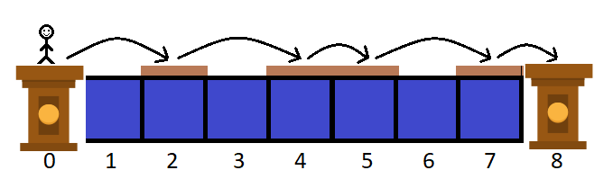

## Knowledge Used
* greedy

## Problem
There is a river of width n. The left bank of the river is cell 0 and the right bank is cell n+1 (more formally, the river can be represented as a sequence of n+2 cells numbered from 0 to n+1). There are also m wooden platforms on a river, the i-th platform has length ci (so the i-th platform takes ci consecutive cells of the river). It is guaranteed that the sum of lengths of platforms does not exceed n.
 
You are standing at 0 and want to reach n+1 somehow. If you are standing at the position x, you can jump to any position in the range [x+1;x+d]. However you don't really like the water so you can jump only to such cells that belong to some wooden platform. For example, if d=1, you can jump only to the next position (if it belongs to the wooden platform). You can assume that cells 0 and n+1 belong to wooden platforms.
 
You want to know if it is possible to reach n+1 from 0 if you can move any platform to the left or to the right arbitrary number of times (possibly, zero) as long as they do not intersect each other (but two platforms can touch each other). It also means that you cannot change the relative order of platforms.
 
Note that you should move platforms until you start jumping (in other words, you first move the platforms and then start jumping).
 
For example, if n=7, m=3, d=2 and c=[1,2,1], then one of the ways to reach 8 from 0 is follow:

#### Input
The first line of the input contains three integers n, m and d (1≤n,m,d≤1000,m≤n) — the width of the river, the number of platforms and the maximum distance of your jump, correspondingly.
 
The second line of the input contains m integers c1,c2,…,cm $(1 \leq c_i \leq n, \sum_{i=1}^{m} c_i \leq n)$, where ci is the length of the i-th platform.

#### Output
If it is impossible to reach n+1 from 0, print NO in the first line. Otherwise, print YES in the first line and the array a of length n in the second line — the sequence of river cells (excluding cell 0 and cell n+1).
 
If the cell i does not belong to any platform, ai should be 0. Otherwise, it should be equal to the index of the platform (1-indexed, platforms are numbered from 1 to m in order of input) to which the cell i belongs.
 
Note that all ai equal to 1 should form a contiguous subsegment of the array a of length c1, all ai equal to 2 should form a contiguous subsegment of the array a of length c2, ..., all ai equal to m should form a contiguous subsegment of the array a of length cm. The leftmost position of 2 in a should be greater than the rightmost position of 1, the leftmost position of 3 in a should be greater than the rightmost position of 2, ..., the leftmost position of m in a should be greater than the rightmost position of m−1.
 
See example outputs for better understanding.